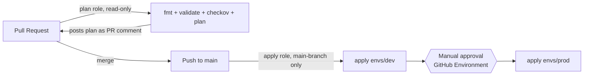

# terraform-cicd-pipeline

A GitHub Actions pipeline for Terraform: every PR gets a plan, a format
check, and a security scan; merging to `main` auto-deploys dev and asks
a human before touching prod. Authentication to AWS uses two separate
OIDC roles instead of long-lived access keys.

## Architecture



## Why two OIDC roles instead of one

- The **plan role** is read-only and its trust policy allows any pull
  request from this repo to assume it. Worst case, a PR build can only
  ever read state and describe resources — it structurally cannot change
  anything, no matter what the PR's code tries to do.
- The **apply role** has write permissions, but its trust policy is
  scoped to `ref:refs/heads/main` specifically. A PR-triggered workflow
  run can never assume it — only a workflow run triggered by a push that
  has already landed on `main` can, which means merging is the only way
  to get write access, not a config mistake in the PR workflow.
- No AWS access keys exist anywhere in this repo or its secrets — nothing
  to leak from a compromised Actions log, nothing to rotate.

## One-time manual setup

None of this is Terraform-managed — an OIDC provider and IAM roles are
exactly the kind of resource you don't want your own pipeline able to
recreate, and Terraform's `backend` block can't reference another
resource's output anyway (same reasoning as project 1's bucket setup).

### 1. Create the OIDC provider (once per AWS account)

```bash
aws iam create-open-id-connect-provider \
  --url https://token.actions.githubusercontent.com \
  --client-id-list sts.amazonaws.com \
  --thumbprint-list 6938fd4d98bab03faadb97b34396831e3780aea1
```

### 2. Create the plan role (read-only, any PR from this repo)

Trust policy (`plan-trust-policy.json`):

```json
{
  "Version": "2012-10-17",
  "Statement": [{
    "Effect": "Allow",
    "Principal": { "Federated": "arn:aws:iam::<ACCOUNT_ID>:oidc-provider/token.actions.githubusercontent.com" },
    "Action": "sts:AssumeRoleWithWebIdentity",
    "Condition": {
      "StringEquals": { "token.actions.githubusercontent.com:aud": "sts.amazonaws.com" },
      "StringLike": { "token.actions.githubusercontent.com:sub": "repo:<YOUR_GH_USER>/terraform-cicd-pipeline:*" }
    }
  }]
}
```

```bash
aws iam create-role --role-name terraform-cicd-plan-role \
  --assume-role-policy-document file://plan-trust-policy.json

aws iam put-role-policy --role-name terraform-cicd-plan-role \
  --policy-name plan-read-only \
  --policy-document '{
    "Version": "2012-10-17",
    "Statement": [{
      "Effect": "Allow",
      "Action": ["s3:GetObject", "s3:ListBucket", "s3:GetBucketVersioning", "s3:GetEncryptionConfiguration", "s3:GetBucketPublicAccessBlock", "dynamodb:GetItem", "dynamodb:PutItem", "dynamodb:DeleteItem"],
      "Resource": "*"
    }]
  }'
```

### 3. Create the apply role (write, main branch only)

Trust policy (`apply-trust-policy.json`) — note the `ref:refs/heads/main` restriction:

```json
{
  "Version": "2012-10-17",
  "Statement": [{
    "Effect": "Allow",
    "Principal": { "Federated": "arn:aws:iam::<ACCOUNT_ID>:oidc-provider/token.actions.githubusercontent.com" },
    "Action": "sts:AssumeRoleWithWebIdentity",
    "Condition": {
      "StringEquals": { "token.actions.githubusercontent.com:aud": "sts.amazonaws.com" },
      "StringLike": { "token.actions.githubusercontent.com:sub": "repo:<YOUR_GH_USER>/terraform-cicd-pipeline:ref:refs/heads/main" }
    }
  }]
}
```

```bash
aws iam create-role --role-name terraform-cicd-apply-role \
  --assume-role-policy-document file://apply-trust-policy.json

aws iam put-role-policy --role-name terraform-cicd-apply-role \
  --policy-name apply-s3-bucket-lifecycle \
  --policy-document '{
    "Version": "2012-10-17",
    "Statement": [{
      "Effect": "Allow",
      "Action": ["s3:CreateBucket", "s3:DeleteBucket", "s3:PutBucketVersioning", "s3:PutEncryptionConfiguration", "s3:PutBucketPublicAccessBlock", "s3:GetObject", "s3:PutObject", "s3:ListBucket", "s3:GetBucketVersioning", "s3:GetEncryptionConfiguration", "s3:GetBucketPublicAccessBlock", "dynamodb:GetItem", "dynamodb:PutItem", "dynamodb:DeleteItem"],
      "Resource": "*"
    }]
  }'
```

### 4. Create the state bucket and lock table

```bash
aws s3api create-bucket --bucket <your-bucket-name> --region eu-central-1 \
  --create-bucket-configuration LocationConstraint=eu-central-1
aws s3api put-bucket-versioning --bucket <your-bucket-name> \
  --versioning-configuration Status=Enabled
aws s3api put-bucket-encryption --bucket <your-bucket-name> \
  --server-side-encryption-configuration '{"Rules":[{"ApplyServerSideEncryptionByDefault":{"SSEAlgorithm":"AES256"}}]}'
aws s3api put-public-access-block --bucket <your-bucket-name> \
  --public-access-block-configuration BlockPublicAcls=true,IgnorePublicAcls=true,BlockPublicPolicy=true,RestrictPublicBuckets=true

aws dynamodb create-table --table-name terraform-locks \
  --attribute-definitions AttributeName=LockID,AttributeType=S \
  --key-schema AttributeName=LockID,KeyType=HASH \
  --billing-mode PAY_PER_REQUEST --region eu-central-1
```

Then fill in the bucket name in both `envs/dev/dev.s3.tfbackend` and
`envs/prod/prod.s3.tfbackend`.

### 5. Add the two role ARNs as GitHub secrets

Repo Settings → Secrets and variables → Actions:
- `AWS_PLAN_ROLE_ARN`
- `AWS_APPLY_ROLE_ARN`

### 6. Create a `production` GitHub Environment with a required reviewer

Repo Settings → Environments → New environment → name it `production` →
add yourself as a required reviewer. This is what makes `apply-prod`
pause for approval.

### 7. Require the PR checks on `main`

Repo Settings → Branches → Branch protection rule for `main` → require
the `plan` status check to pass before merging.

## Day-to-day flow

1. Open a PR. The `plan` job runs `fmt`, `validate`, `checkov`, and
   `terraform plan`, posting the plan as a comment on the PR (updated in
   place on each push, not duplicated).
2. Merge to `main`. `apply-dev` runs automatically.
3. `apply-prod` waits for a reviewer to approve it in the Actions tab,
   then applies the same change to `envs/prod`.

## Trade-offs

- Both environments share one state bucket (different keys) rather than
  fully separate buckets — simpler to set up, at the cost of a single
  blast radius for the bucket itself (not the state it holds, since keys
  are separate).
- Dev auto-applies with no gate at all; only prod is gated. That mirrors
  how most teams actually treat dev vs. prod, but it does mean a bad PR
  that somehow passes `plan`/`checkov` can break dev before a human
  looks at it.
- **This workflow has not been executed against a real PR or push** — this
  environment has no AWS credentials to complete the manual setup above
  or trigger a real Actions run. The YAML has been checked for syntax
  validity only. Treat the first real PR against this repo as the actual
  test of the pipeline.

## Skills demonstrated

- OIDC federation with two separately-scoped IAM roles (read vs. write,
  any-PR vs. main-branch-only)
- Policy-as-code security scanning (Checkov) as a PR gate
- GitHub Environment protection rules for manual promotion gates
- PR-based plan review via an automated, self-updating PR comment
- Pinning third-party GitHub Actions to commit SHAs rather than mutable tags
