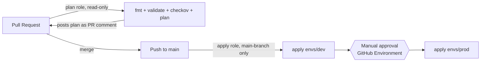

# terraform-cicd-pipeline

A GitHub Actions pipeline for Terraform: every PR gets a plan, a format
check, and a security scan; merging to `main` auto-deploys dev and asks
a human before touching prod. Authentication to AWS uses two separate
OIDC roles instead of long-lived access keys.

## Architecture



## Why two OIDC roles instead of one

- The **plan role** is read-only and its trust policy allows pull
  requests from branches within this repository to assume it. Fork PRs
  are a known limitation here, not a feature: `pull_request` events
  triggered by a fork don't receive repository secrets, so
  `secrets.AWS_PLAN_ROLE_ARN` is empty for a fork PR and the credentials
  step simply errors out — it doesn't silently run with the wrong
  permissions. For PRs from within this repo, worst case a PR build can
  only ever read state and describe resources — it structurally cannot
  change anything, no matter what the PR's code tries to do.
- The **apply role** has write permissions. Its trust policy allows two
  subject-claim values: `ref:refs/heads/main` (for `apply-dev`, a plain
  push-triggered job with no `environment:`) and `environment:production`
  (for `apply-prod`, which references the `production` GitHub
  Environment). GitHub replaces the `ref:` segment of the subject claim
  entirely once a job references an Environment, so `environment:production`
  is **not** branch-scoped by the trust policy alone — the trust policy
  would happily authenticate that claim from any branch capable of
  reaching a `production`-gated job. What actually keeps `apply-prod`
  reachable only from `main` is the `production` Environment's own
  **deployment branch policy**, set to "Selected branches" → `main` only
  (setup step 6). The IAM trust policy and the Environment's branch
  policy are both load-bearing here; neither alone is sufficient.
- No AWS access keys exist anywhere in this repo or its secrets — nothing
  to leak from a compromised Actions log, nothing to rotate.

## One-time manual setup

None of this is Terraform-managed — an OIDC provider and IAM roles are
exactly the kind of resource you don't want your own pipeline able to
recreate, and Terraform's `backend` block can't reference another
resource's output anyway. This mirrors how you'd bootstrap Terraform
state for any new AWS account: the state bucket, lock table, OIDC
provider, and IAM roles are all created once, by hand, since Terraform
can't create the backend it will then use to manage everything else.

### 1. Create the OIDC provider (once per AWS account)

```bash
aws iam create-open-id-connect-provider \
  --url https://token.actions.githubusercontent.com \
  --client-id-list sts.amazonaws.com \
  --thumbprint-list 6938fd4d98bab03faadb97b34396831e3780aea1
```

### A note on the OIDC subject-claim format

GitHub's `token.actions.githubusercontent.com:sub` claim identifies the
repo that requested the token, and the format of that identifier changed
over time:

- **Legacy format**: `repo:OWNER/REPO:ref:refs/heads/BRANCH` (or
  `:pull_request`, `:environment:NAME`) — keyed on the owner/repo *name*.
- **Immutable format**: `repo:OWNER@OWNER-ID/REPO@REPO-ID:ref:refs/heads/BRANCH`
  (etc.) — keyed on the owner and repo's numeric IDs, so the claim
  survives a repo rename or transfer. Repositories created after
  July 15, 2026 use this format by default.

This repo (`HowlinMan24/terraform-cicd-pipeline`, created 2026-08-03)
uses the immutable format, so that's what the trust policies below
embed: owner ID `165219781`, repo ID `1322168955`, looked up with:

```bash
gh api repos/HowlinMan24/terraform-cicd-pipeline --jq '{owner_id: .owner.id, repo_id: .id}'
```

**If you're adapting this for your own repo**, don't copy these IDs —
they're specific to this repository. Run the same `gh api` command
against `<your-org>/<your-repo>` and substitute the result. If your repo
predates the July 15, 2026 cutover and hasn't opted into the new format,
GitHub still issues the legacy `repo:OWNER/REPO:...` claim instead, and
your trust policy's `sub` condition should use that format — check your
own repo's actual token claims (or its OIDC subject-claim customization
setting) rather than assuming either format.

### 2. Create the plan role (read-only, PRs from within this repo)

Trust policy (`plan-trust-policy.json`):

```json
{
  "Version": "2012-10-17",
  "Statement": [{
    "Effect": "Allow",
    "Principal": { "Federated": "arn:aws:iam::<ACCOUNT_ID>:oidc-provider/token.actions.githubusercontent.com" },
    "Action": "sts:AssumeRoleWithWebIdentity",
    "Condition": {
      "StringEquals": { "token.actions.githubusercontent.com:aud": "sts.amazonaws.com" },
      "StringLike": { "token.actions.githubusercontent.com:sub": "repo:HowlinMan24@165219781/terraform-cicd-pipeline@1322168955:*" }
    }
  }]
}
```

```bash
aws iam create-role --role-name terraform-cicd-plan-role \
  --assume-role-policy-document file://plan-trust-policy.json

aws iam put-role-policy --role-name terraform-cicd-plan-role \
  --policy-name plan-read-only \
  --policy-document '{
    "Version": "2012-10-17",
    "Statement": [
      {
        "Sid": "BackendStateRead",
        "Effect": "Allow",
        "Action": ["s3:GetObject", "s3:ListBucket"],
        "Resource": ["arn:aws:s3:::<your-bucket-name>", "arn:aws:s3:::<your-bucket-name>/*"]
      },
      {
        "Sid": "StateLockRead",
        "Effect": "Allow",
        "Action": ["dynamodb:GetItem", "dynamodb:PutItem", "dynamodb:DeleteItem"],
        "Resource": "arn:aws:dynamodb:eu-central-1:<ACCOUNT_ID>:table/terraform-locks"
      },
      {
        "Sid": "DemoBucketRead",
        "Effect": "Allow",
        "Action": [
          "s3:GetBucketVersioning", "s3:GetEncryptionConfiguration", "s3:GetBucketPublicAccessBlock",
          "s3:GetBucketTagging", "s3:GetBucketAcl", "s3:GetBucketLocation", "s3:GetBucketLogging",
          "s3:GetLifecycleConfiguration"
        ],
        "Resource": ["arn:aws:s3:::terraform-cicd-*", "arn:aws:s3:::terraform-cicd-*/*"]
      }
    ]
  }'
```

The `dynamodb:PutItem`/`DeleteItem` in `StateLockRead` aren't a typo for
a read-only role: `terraform plan` still acquires and releases the state
lock by default, which needs write access to the lock table even though
it never writes to the state object itself. The `DemoBucketRead`
statement is scoped to `terraform-cicd-*`, matching this repo's actual
`bucket_prefix` defaults (`terraform-cicd-dev` / `terraform-cicd-prod`)
rather than granting `Resource: "*"`.

### 3. Create the apply role (write, main branch or the production Environment)

Trust policy (`apply-trust-policy.json`) — two subject claims: one for
`apply-dev` (a plain push to `main`), one for `apply-prod` (which runs
under the `production` GitHub Environment, replacing the `ref:` segment
of the subject entirely):

```json
{
  "Version": "2012-10-17",
  "Statement": [{
    "Effect": "Allow",
    "Principal": { "Federated": "arn:aws:iam::<ACCOUNT_ID>:oidc-provider/token.actions.githubusercontent.com" },
    "Action": "sts:AssumeRoleWithWebIdentity",
    "Condition": {
      "StringEquals": { "token.actions.githubusercontent.com:aud": "sts.amazonaws.com" },
      "StringLike": {
        "token.actions.githubusercontent.com:sub": [
          "repo:HowlinMan24@165219781/terraform-cicd-pipeline@1322168955:ref:refs/heads/main",
          "repo:HowlinMan24@165219781/terraform-cicd-pipeline@1322168955:environment:production"
        ]
      }
    }
  }]
}
```

The `environment:production` condition is not branch-scoped by itself —
see "Why two OIDC roles" below for why the `production` Environment's
deployment branch policy (setup step 6) is what actually keeps it
restricted to `main`.

```bash
aws iam create-role --role-name terraform-cicd-apply-role \
  --assume-role-policy-document file://apply-trust-policy.json

aws iam put-role-policy --role-name terraform-cicd-apply-role \
  --policy-name apply-s3-bucket-lifecycle \
  --policy-document '{
    "Version": "2012-10-17",
    "Statement": [
      {
        "Sid": "BackendStateReadWrite",
        "Effect": "Allow",
        "Action": ["s3:GetObject", "s3:PutObject", "s3:ListBucket"],
        "Resource": ["arn:aws:s3:::<your-bucket-name>", "arn:aws:s3:::<your-bucket-name>/*"]
      },
      {
        "Sid": "StateLockReadWrite",
        "Effect": "Allow",
        "Action": ["dynamodb:GetItem", "dynamodb:PutItem", "dynamodb:DeleteItem"],
        "Resource": "arn:aws:dynamodb:eu-central-1:<ACCOUNT_ID>:table/terraform-locks"
      },
      {
        "Sid": "DemoBucketReadWrite",
        "Effect": "Allow",
        "Action": [
          "s3:CreateBucket", "s3:DeleteBucket",
          "s3:PutBucketVersioning", "s3:PutEncryptionConfiguration", "s3:PutBucketPublicAccessBlock", "s3:PutBucketTagging",
          "s3:GetBucketVersioning", "s3:GetEncryptionConfiguration", "s3:GetBucketPublicAccessBlock",
          "s3:GetBucketTagging", "s3:GetBucketAcl", "s3:GetBucketLocation", "s3:GetBucketLogging",
          "s3:GetLifecycleConfiguration"
        ],
        "Resource": ["arn:aws:s3:::terraform-cicd-*", "arn:aws:s3:::terraform-cicd-*/*"]
      }
    ]
  }'
```

### 4. Create the state bucket and lock table

```bash
aws s3api create-bucket --bucket <your-bucket-name> --region eu-central-1 \
  --create-bucket-configuration LocationConstraint=eu-central-1
aws s3api put-bucket-versioning --bucket <your-bucket-name> \
  --versioning-configuration Status=Enabled
aws s3api put-bucket-encryption --bucket <your-bucket-name> \
  --server-side-encryption-configuration '{"Rules":[{"ApplyServerSideEncryptionByDefault":{"SSEAlgorithm":"AES256"}}]}'
aws s3api put-public-access-block --bucket <your-bucket-name> \
  --public-access-block-configuration BlockPublicAcls=true,IgnorePublicAcls=true,BlockPublicPolicy=true,RestrictPublicBuckets=true

aws dynamodb create-table --table-name terraform-locks \
  --attribute-definitions AttributeName=LockID,AttributeType=S \
  --key-schema AttributeName=LockID,KeyType=HASH \
  --billing-mode PAY_PER_REQUEST --region eu-central-1
```

Then fill in the bucket name in both `envs/dev/dev.s3.tfbackend` and
`envs/prod/prod.s3.tfbackend`.

### 5. Add the two role ARNs as GitHub secrets

Repo Settings → Secrets and variables → Actions:
- `AWS_PLAN_ROLE_ARN`
- `AWS_APPLY_ROLE_ARN`

### 6. Create a `production` GitHub Environment with a required reviewer

Repo Settings → Environments → New environment → name it `production` →
add yourself as a required reviewer. This is what makes `apply-prod`
pause for approval.

**Also set the deployment branch policy**, in the same Environment
settings: "Deployment branches and tags" → "Selected branches and tags"
→ add `main` only. This step is not optional. As covered above, the
apply role's trust policy allows the `environment:production` subject
claim from *any* branch that can reach a job gated on the `production`
Environment — the trust policy alone doesn't restrict it to `main`. The
Environment's deployment branch policy is what actually enforces that,
by refusing to hand out a `production`-scoped OIDC token to a workflow
run on any other branch in the first place.

### 7. Require the PR checks on `main`

Repo Settings → Branches → Branch protection rule for `main` → require
the `plan` status check to pass before merging.

## Day-to-day flow

1. Open a PR. The `plan` job runs `fmt`, `validate`, `checkov`, and
   `terraform plan` for `envs/dev`, posting the plan as a comment on the
   PR (updated in place on each push, not duplicated). A second `plan-prod`
   job does the same `terraform plan` for `envs/prod` and posts it as its
   own comment, so the PR shows both plans before anything merges.
2. Merge to `main`. `apply-dev` runs automatically.
3. `apply-prod` waits for a reviewer to approve it in the Actions tab,
   then applies the same change to `envs/prod` — the reviewer approving
   that gate has already seen the prod plan from step 1's PR comment, not
   just the dev apply's outcome.

## Trade-offs

- Both environments share one state bucket (different keys) rather than
  fully separate buckets — simpler to set up, at the cost of a single
  blast radius for the bucket itself (not the state it holds, since keys
  are separate).
- Dev auto-applies with no gate at all; only prod is gated. That mirrors
  how most teams actually treat dev vs. prod, but it does mean a bad PR
  that somehow passes `plan`/`checkov` can break dev before a human
  looks at it.
- Checkov scans the whole repo (`directory: .`) rather than just
  `envs/dev`, because `envs/dev` itself is only a `module` block — the
  actual resources live in `modules/s3-bucket`, and scanning just the
  root would mean the gate never sees a real resource. A handful of
  default Checkov checks are explicitly skipped inline on the module's
  resources (access logging, KMS-vs-AES256, lifecycle configuration,
  event notifications) because this demo bucket is deliberately minimal
  by design, not because those checks are wrong in general — see the
  `#checkov:skip` comments in `modules/s3-bucket/main.tf` for the
  per-check justification.
- **This workflow has not been executed against a real PR or push** — this
  environment has no AWS credentials to complete the manual setup above
  or trigger a real Actions run. The YAML has been checked for syntax
  validity only. Treat the first real PR against this repo as the actual
  test of the pipeline.

## Skills demonstrated

- OIDC federation with two separately-scoped IAM roles (read vs. write,
  in-repo-PR vs. main-branch-or-production-Environment)
- Policy-as-code security scanning (Checkov) as a PR gate
- GitHub Environment protection rules for manual promotion gates
- PR-based plan review via an automated, self-updating PR comment
- Pinning third-party GitHub Actions to commit SHAs rather than mutable tags
